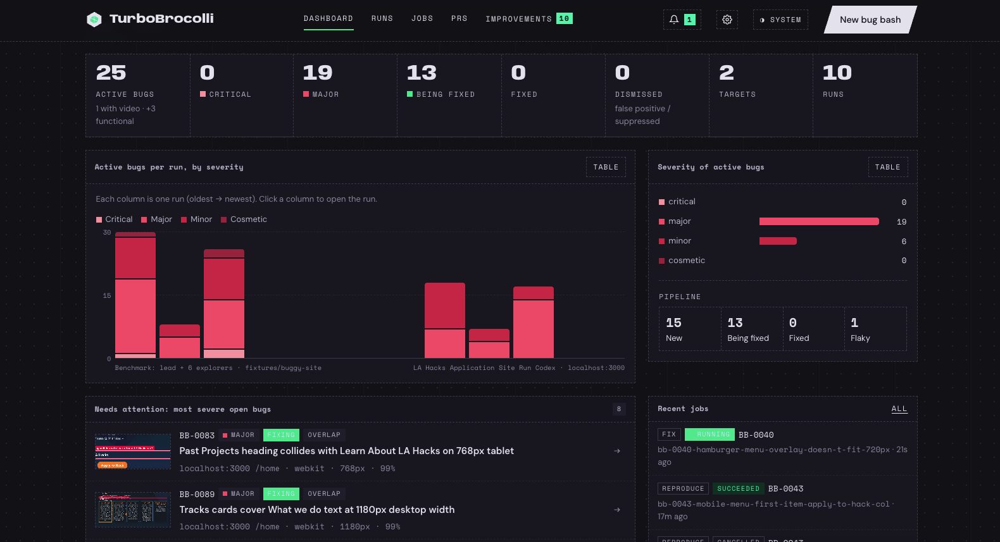

<div align="center">

# Turbo Broccoli

**Find UI bugs. Review the evidence. Fix what matters.**

An agentic UI testing toolkit where a lead agent coordinates browser explorers, independent reviewers assess the evidence, and fixing agents tackle the bugs you choose. Includes a local dashboard, reproducible findings, and verified fix workflows. Powered by Playwright, Claude Code, and Codex.

[Quick start](#quick-start) · [How it works](#how-it-works) · [CLI](#cli) · [Development](#development)

</div>

---

Turbo Broccoli explores your web app across browsers, screen sizes, devices, and user personas to find visual and interaction defects: clipped text, overlapping elements, horizontal overflow, small tap targets, layout shifts, and broken UI states.

Each finding brings evidence you can inspect: screenshots, reproduction steps, confidence signals, source hints, and generated Playwright tests. Review findings in the dashboard, reproduce them in a real browser, and request fixes individually or by shared root cause.

The dashboard lives in `web/`; the underlying CLI is called **`bugbash`**. You can use either interface against a live URL, a local static site, or a local application repository.



*An early preview of the Turbo Broccoli dashboard. The interface has evolved since this screenshot.*

## What you can do

- **Explore across environments.** Test Chromium, WebKit, and Firefox with desktop viewports, phone and tablet emulation, and personas such as everyday, phone, keyboard, and impatient users.
- **Turn observations into evidence.** Replay findings in fresh browsers, minimize reproduction steps, annotate screenshots, and generate videos, traces, and regression test specs.
- **Review in one place.** Filter findings by severity, confidence, browser, persona, and status. Inspect root-cause groups, coverage, agent activity, and comparisons between runs.
- **Reproduce interactively.** Open a browser with a finding’s recorded environment and replay its steps before investigating it yourself.
- **Request and verify fixes.** Create a branch and worktree, follow the fixing agent live, and inspect replay verification, before/after evidence, diffs, and optional GitHub pull requests.
- **Improve future runs.** Confirm findings, label false positives, calibrate confidence, and review retrospective proposals before approving changes.
- **Choose your agent provider.** Use Claude Code or Codex, select models, and switch active agents during a job with a handoff of recorded progress.

## Quick start

### Requirements

| Dependency | Purpose |
| --- | --- |
| Node.js **22+** and npm | Run the CLI and dashboard |
| **Claude Code or Codex**, installed and signed in | Run agent phases using the CLI’s existing authentication |
| Playwright browser binaries | Drive Chromium, WebKit, and Firefox |
| Git | Create branches and worktrees for fixes |
| GitHub CLI (`gh`), signed in | Optional: push fix branches and open pull requests |
| `ffmpeg` | Optional: produce MP4, GIF, and filmstrip evidence |
| Xcode or its Command Line Tools (macOS) | Optional: compile the native notification helper once; notifications use a 🥦 icon and open the related job when clicked |

macOS notifications create a cached TurboBrocolli app under `~/.bugbash/macos-notifier`. Allow its first notification permission prompt (or enable TurboBrocolli in System Settings → Notifications). Keep the web app URL in dashboard settings pointed at your running dashboard.

Install and sign in to the provider you intend to use before starting an agent job. Provider and model availability depend on your CLI installation and account.

### Install

From a local clone of this repository:

```bash
npm install
npx playwright install chromium webkit firefox
npm run web:install
```

### Open the dashboard

```bash
npm run web
```

Open **[localhost:4317](http://127.0.0.1:4317)**. The development API runs on port `4318`.

In **Settings**, choose your default agent provider. Launch a new bug bash with a URL or local path, select a preset, and follow the exploration and triage jobs live. The dashboard discovers workspaces registered by the CLI; you can also add a workspace from the Runs page.

### Run your first bug bash from the terminal

```bash
# Explore a local app and triage its findings using Codex
./bin/bugbash.js --provider codex explore ../my-app --preset quick --then-triage

# Or use Claude Code against an already-running app
./bin/bugbash.js --provider claude explore http://localhost:3000 --then-triage

# List findings from the latest run
./bin/bugbash.js list
```

Local repositories with a `dev` or `start` script can have their server started automatically. Static folders are served locally. For a URL whose source is available, add `--repo ../my-app` to enable source inspection and fixes.

## How it works

```text
Explore                 Triage                    Review & fix
───────                 ──────                    ────────────
Plan across personas →  Cluster findings       →   Inspect evidence
Probe UI and devices    Replay and minimize        Request selected fixes
Record observations     Annotate and review        Edit in a worktree
Track coverage          Group by root cause        Replay verification
                                                  Optional pull request
```

### Agents that plan, probe, and adapt

You give the agents a target and a budget. They choose which flows to investigate, interact with the actual UI through Playwright tools, inspect screenshots and measurements, and decide what to try next. The exploration path develops as they learn about the app.

| Role | What the agent does |
| --- | --- |
| **Lead agent** | Reads the site map, prior-run memory, and available code hints. Assigns concrete goals to explorer agents across personas, browsers, and devices, then replans as their results arrive. |
| **Explorer agents** | Work in parallel within the configured limit. Follow a **guess → probe → confirm** loop: identify a weak spot, test it through browser actions, inspect the result, and record a finding or a refuted hypothesis. |
| **Independent reviewer** | Assesses findings from their evidence in a fresh context, without the explorer’s reasoning, to help separate real defects from false positives. |
| **Root-cause grouping agent** | Helps connect findings that may share an underlying component or source-level cause, so related bugs can be investigated and fixed together. |
| **Fixing agent** | When requested, edits the local source in a separate branch and worktree, using scoped file and browser tools to investigate and check the change. |
| **Retrospective agent** | Reviews a run and proposes lessons, strategy changes, or detector improvements for your approval. |

The lead reacts to discoveries: it can send explorers deeper into a page where bugs cluster, ask them to check other instances of a shared component, cross-check a Chromium finding in WebKit or Firefox, and fill gaps in page or device coverage. Its decisions are recorded for inspection. Configured session, tool-call, and time limits constrain the campaign; it can also stop when new findings dry up.

For example, an explorer might discover that opening a navigation menu on a short phone hides its close button. That finding can prompt another session to test the same menu elsewhere in the app or in another browser. Triage then replays the recorded steps in fresh browsers, measures reproducibility, and prepares evidence for review.

### Evidence and human control

Agents work alongside deterministic checks. Geometry detectors supply measurable candidates; replay checks whether a finding reproduces; step minimization reduces the sequence needed to trigger it. Triage replays findings three times by default and produces annotated screenshots, generated Playwright specs, and video evidence where appropriate. Confidence combines several signals, with calibration informed by your labels.

You can follow agent activity in the dashboard, send instructions during a job, and switch between Claude Code and Codex or change models. Provider changes start a new agent session with a bounded handoff of the task and recorded progress, while the job’s browser sessions and files carry over. See [the provider guide](docs/model-providers.md) for the handoff details.

Exploration records findings; fixes start when you request them. Fix verification replays affected environments and compares detector snapshots for regressions, with feedback available for another fix attempt. The dashboard exposes verification outcomes and branch changes before publishing a PR. Retrospective proposals also require approval before they are applied. Browser guardrails and campaign budgets are enforced by the tool layer.

Geometry detectors and agent judgments can produce false positives or miss defects. Confidence scores and replay evidence support review; they are not guarantees that a finding or fix is correct.

## The local dashboard

| Area | What it shows or controls |
| --- | --- |
| Dashboard | Latest target state, severity breakdowns, open bugs, and recent jobs |
| Runs | Run history, filters, root-cause groups, selection actions, and archived findings |
| Bug details | Screenshots, video timeline, expected/actual behavior, steps, traces, source hints, and confidence |
| Jobs | Live stages, agent conversations, provider switching, and fix verification |
| Pull requests | Branch diffs, PR status and checks, and descriptions refreshed from saved evidence |
| Compare | Findings and evidence across two runs, with synchronized screenshot viewing |
| Agents | Coverage, tool usage, discovery patterns, and available token/cost metrics |
| Improvements | Retrospective proposals, approval decisions, and implementation jobs |
| Schedules & settings | macOS scheduling, notifications, workspaces, and provider defaults |

PR creation asks for confirmation before pushing to `origin`. Refreshing a PR description uses the current diff and saved verification evidence; it does not rerun verification. Manual verification must be explicitly confirmed in the update dialog.

Background jobs persist status and events on disk, so the dashboard can reconnect after a page reload or server restart. The API binds to `127.0.0.1`; the dashboard is intended for local use.

For a built dashboard:

```bash
npm run web:build
npm run web:start
```

To discover additional workspaces explicitly:

```bash
BUGBASH_WORKSPACES=/path/to/app-a/.bugbash:/path/to/app-b/.bugbash npm run web
```

## CLI

Run `./bin/bugbash.js --help` or add `--help` to a command for all options.

```bash
# Explore a static folder, or a URL with local source
./bin/bugbash.js explore ./public --then-triage
./bin/bugbash.js explore https://staging.example.com --repo ../my-app --then-triage

# Limit a campaign or select a device-focused preset
./bin/bugbash.js explore ../my-app --browsers chromium --budget-sessions 4
./bin/bugbash.js explore ../my-app --preset mobile --then-triage

# Re-triage a saved run and open an interactive reproduction
./bin/bugbash.js triage --run <run-id-or-path>
./bin/bugbash.js reproduce BB-0007 --browser webkit

# Organize findings and teach the false-positive filter
./bin/bugbash.js mark BB-0003 BB-0004 --todo
./bin/bugbash.js label BB-0009 false_positive --note "intentional truncation"
./bin/bugbash.js label BB-0003 confirmed

# Request a fix; --pr explicitly pushes and creates a pull request
./bin/bugbash.js fix BB-0007
./bin/bugbash.js fix RC-002 --pr --draft
```

Built-in presets are `standard`, `quick`, `mobile`, `desktop`, and `deep`. Defaults can also be set in the target repository’s `bugbash.config.json`; see [the configuration schema](src/config.ts). Provider overrides use `--provider claude` or `--provider codex`, with an optional `--model <name>`.

For provider setup, runtime handoff behavior, and startup troubleshooting, see [the provider guide](docs/model-providers.md).

## Data and browser guardrails

Run data defaults to `<target-repo>/.bugbash`, or `./.bugbash` for URL targets. Use `--out <directory>` to choose another workspace. Workspaces are ignored by Git, and run artifacts are stored on your machine. Agent requests still go through the selected provider’s CLI; local storage does not mean offline processing.

With the default guardrails, browser navigation stays on the target origin, destructive-action labels are blocked, mutation requests to allowed origins are blocked, dialogs are dismissed, and popups are closed. These limits can prevent flows that require form submissions or external authentication from completing.

| Output | Contents |
| --- | --- |
| `findings.json` / `findings.flat.jsonl` | Findings, root-cause groups, status, evidence, and reproduction metadata |
| `report.html` / `summary.md` | Standalone reports for review and sharing |
| `shots/`, `videos/`, `traces/` | Visual evidence and Playwright traces |
| `repros/` | Generated Playwright specs that fail while the recorded defect exists |
| `run.json`, `sessions/`, `transcripts/`, `coverage/` | Run configuration, decisions, agent activity, and coverage |

These files live under `<workspace>/runs/<timestamp>/`. Cross-run memory, labels, suppression patterns, and calibration live under `<workspace>/memory/`. Evidence and transcripts can contain page content and source details; review them before sharing.

## Development

The CLI and agent pipeline use TypeScript, Playwright, MCP, and Vitest. The dashboard uses React and Vite with a Hono API that reads run data from disk.

```bash
# CLI checks
npm run typecheck
npm test
npm run build

# Dashboard checks
npm --prefix web run typecheck
npm run web:test
npm run web:build

# End-to-end benchmark: requires a signed-in agent provider
./bin/bugbash.js bench --budget-sessions 6
```

Unit and integration tests run without live model calls. The benchmark uses the seeded defects in `fixtures/buggy-site`, described in [the benchmark manifest](bench/manifest.json). Live provider availability and the complete exploration/fix workflow require an end-to-end run.

| Directory | Purpose |
| --- | --- |
| `src/explore/`, `src/triage/`, `src/fix/` | Exploration, evidence processing, and fix verification |
| `src/llm/`, `src/mcp/` | Provider adapters and scoped agent tools |
| `src/detect/`, `src/replay/`, `src/repro/` | Geometry checks and browser replay |
| `src/store/`, `src/memory/` | Run artifacts and cross-run learning |
| `web/` | Local dashboard and API |
| `test/`, `web/test/`, `fixtures/`, `bench/` | Tests, fixtures, and benchmark definitions |

When reporting a bug, include the command or dashboard action, relevant environment, expected and actual behavior, and a minimal reproduction. For changes, keep the scope focused and run the checks relevant to the affected code.

The previous README is preserved in [the documentation archive](docs/archive/README-original.md).
